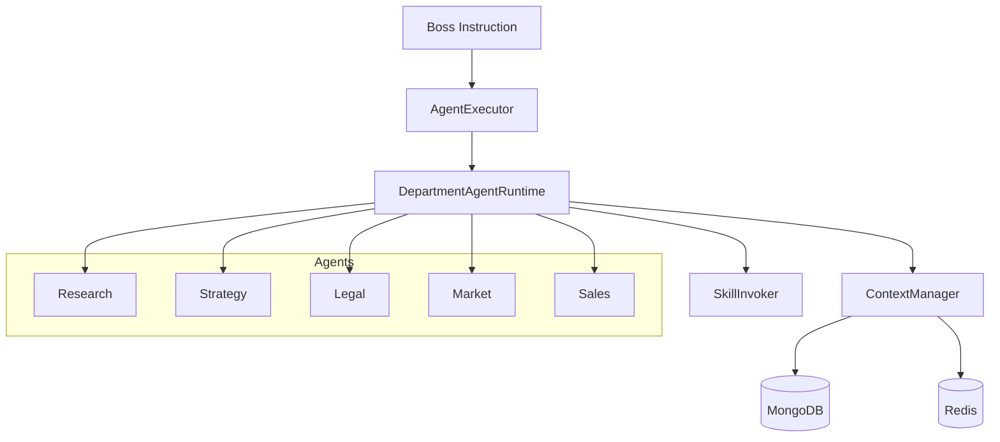

# OpenClaw Runtime 阶段1架构分析报告

## 1. 结论摘要

当前 `openclaw-runtime` 不是原始“单体执行器”状态，而是处于**半成品协同架构**：

- 已有五部门 Agent 抽象与实现（research/strategy/legal/market/sales）。
- 已有执行器（并行/串行）、上下文管理器（Mongo+Redis 黑板接口）、技能调用器（HTTP）。
- 但缺少统一编排入口（Orchestrator）、依赖调度器、结果聚合器、监控器、错误恢复策略。

因此阶段1建议：**不从头重写**，采用“融合化改造”，以现有模块为骨架，新增薄层中台。

## 2. 代码结构与职责分析

### 2.1 已有模块盘点

| 模块 | 当前状态 | 主要职责 | 评估 |
|---|---|---|---|
| `department-agents/base-agent.ts` | 已实现 | 抽象 Agent 生命周期：依赖检查、上下文组装、执行、落盘、异常处理 | 可复用，需增强重试/补偿 |
| `department-agents/*.ts` | 已实现 | 五部门业务逻辑，具备依赖声明 | 可复用，需接技能配置与提示模板 |
| `modified-runtime/execution/agent-executor.ts` | 已实现 | 并行/串行执行，状态记录 | 可复用，需替换为 DAG 调度感知 |
| `modified-runtime/context/context-manager.ts` | 已实现 | Mongo 持久化 + Redis 状态缓存 + 依赖检查 | 可复用，需完善一致性与状态机 |
| `modified-runtime/tools/skill-invoker.ts` | 已实现 | 调 OpenClaw skill 接口 | 可复用，需加超时/重试/熔断/幂等 |
| 聚合器/监控器/依赖管理器 | 缺失 | 结果聚合、可观测性、依赖编排 | 需新增 |

### 2.2 当前调用关系图

### 2.3 关键数据流

1. Boss 下发任务（taskId + instruction）。
2. Agent 读取 task 与依赖输出（黑板）。
3. Agent 执行并保存 `DepartmentOutput`。
4. Redis 仅保存状态片段（`task:*:status`）。
5. 缺少全局输出聚合与质量评分闭环。

## 3. 技术栈评估

### 3.1 TypeScript 与依赖形态

- 代码使用 TypeScript 类型系统较完整（接口/泛型/字面量联合）。
- 当前目录缺少运行入口与工程化配置文件（如 package.json、tsconfig）在该子目录可见层，推测运行配置在外层项目或尚未补齐。
- `fetch` 被直接使用，默认依赖 Node 18+ 或 polyfill。

### 3.2 存储与一致性

- Mongo：任务与部门输出持久化。
- Redis：任务状态与依赖检查。
- 风险：当前状态键设计是字符串拼接，缺统一状态机，存在“写成功但状态丢失/延迟”一致性风险。

### 3.3 异步与错误处理

- 基础 try/catch 完成。
- 缺：指数退避、重试预算、错误分类、部分失败降级策略。

## 4. 性能瓶颈识别

| 瓶颈点 | 当前表现 | 影响 |
|---|---|---|
| 执行调度 | 仅串行/全并行，无依赖图调度 | 易出现无效等待或错误并发 |
| 黑板访问 | 每个依赖单独查询 | 高任务量下 I/O 放大 |
| 技能调用 | 无超时重试熔断 | 外部波动直接放大失败率 |
| 结果处理 | 无聚合器，后处理分散 | 端到端延迟与质量不可控 |

## 5. 技术债务清单

1. 缺统一 Orchestrator（系统没有“总指挥”）。
2. 缺 DAG 依赖调度器（只能串行/并行二选一）。
3. 缺结果聚合与 LLM-Blender 适配层。
4. 缺执行观测（指标、事件、追踪 ID）。
5. 缺标准化错误策略（重试、补偿、降级）。

## 6. 对“大脑-手脚”目标的适配判断

- 大脑（`competition_router`）已具备：分层路由、协作计划、输出来源标记。
- 手脚（`openclaw-runtime`）已具备：Agent 执行能力与技能调用能力。
- 差距：缺“脑到手”的任务编排协议与“手到脑”的标准回传协议。

阶段1建议产出统一协议：

- 入参：`brainPlan`（tier、selectedAgents、collaborationPlan、riskSummary）。
- 出参：`executionBundle`（perDepartmentOutput、qualityScore、trace、retryLog）。
