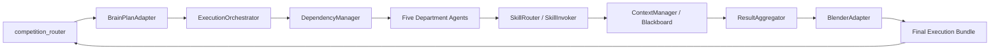

# competition_router -> openclaw-runtime 接入映射

## 1. 目标

把 `competition_router` 里已经成熟的“大脑能力”接到 `openclaw-runtime` 的“手脚执行层”，形成可落地的最小闭环。

这里的原则是：

- `competition_router` 保留为路由中枢与决策中枢。
- `openclaw-runtime` 保留为执行中枢与技能中枢。
- 中间通过适配层进行协议转换，不做重复实现。

## 2. 已有能力 -> 可接入点

| competition_router 能力 | 当前状态 | openclaw-runtime 接入点 | 接入方式 | 复用/新增 |
|---|---|---|---|---|
| `SmallModelRouter.route()` | 已完成 | `ExecutionOrchestrator` / `DependencyManager` | 以 tier 作为部门调度依据 | 复用 |
| `route_experts_by_tier()` | 已完成 | 部门执行计划生成器 | 直接映射为部门执行顺序与协作层 | 复用 |
| `collaboration_plan` | 已完成 | `DependencyManager` / `ExecutionMonitor` | 作为 DAG 与协作关系输入 | 复用 |
| `info_pool_hits` | 已完成 | `ContextManager` / `blackboard` | 作为知识回填与 grounding 输入 | 复用 |
| `pairrank()` | 已完成 | `ResultAggregator` | 作为候选优先级/质量分依据 | 复用 |
| `fuse_rule_based()` | 已完成 | `BlenderAdapter` | 作为最终汇聚的规则融合逻辑 | 复用 |
| `output_attribution` | 已完成 | `ExecutionMonitor` / 回溯日志 | 标记结果来源与可审计性 | 复用 |
| `runtime_trace` | 已完成 | `ExecutionMonitor` / 调试日志 | 记录调用链与后端信息 | 复用 |

## 3. 模块级映射

### 3.1 路由中枢 -> 执行编排

#### 输入
- `tier`
- `selected_experts`
- `collaboration_plan`
- `info_pool_hits`

#### 对应 runtime
- `ExecutionOrchestrator`
- `DependencyManager`

#### 职责
- 把 `competition_router` 的高层决策转成可执行 DAG。
- 决定哪些部门并行，哪些必须等待前置部门输出。

#### 建议实现
- 新增一个轻量适配类，例如 `BrainPlanAdapter`。
- 负责把 `pipeline.run()` 的 JSON 转成 `TaskPlan`。

### 3.2 融合器 -> 结果聚合器

#### 输入
- `ranked_candidates`
- `fused_result`
- `selected_experts`

#### 对应 runtime
- `ResultAggregator`
- `BlenderAdapter`

#### 职责
- 把五部门输出聚成统一结果包。
- 按大脑的结果结构补齐来源、质量、权重。

#### 建议实现
- 结果聚合器先保留规则融合。
- 后续再把 LLM-Blender 接进来做更强质量控制。

### 3.3 来源标注 -> 可观测执行

#### 输入
- `output_attribution`
- `runtime_trace`

#### 对应 runtime
- `ExecutionMonitor`
- `ContextManager` 日志/状态字段

#### 职责
- 记录哪个结果来自小模型，哪个来自规则，哪个来自远程 LLM。
- 让手脚执行可回溯、可审计。

### 3.4 技能召回 -> 技能路由

#### 输入
- `info_pool_hits`
- `selected_experts`
- `collaboration_plan`

#### 对应 runtime
- `SkillRouter`
- `SkillInvoker`

#### 职责
- 根据部门和任务阶段选择对应技能。
- 将大脑的“路由建议”落到技能执行层。

## 4. 推荐接入顺序

### 第一阶段：先接路由与依赖
1. 把 `tier + selected_experts` 接入 `ExecutionOrchestrator`。
2. 把 `collaboration_plan` 接入 `DependencyManager`。
3. 让五部门按脑指挥顺序执行。

### 第一阶段实施状态（当前）
- [x] `BrainPlanAdapter` 已实现（`pipeline.run()` 输出 -> `TaskPlan`）。
- [x] `DependencyManager` 已实现（DAG 环检测 + 拓扑分批执行）。
- [x] `ExecutionOrchestrator` 已实现（统一调度 `AgentExecutor`）。
- [x] `ExecutionMonitor` 已实现（任务/部门事件记录）。
- [ ] 统一入口 wiring（将上述模块接入运行主入口）待完成。

### 第二阶段：接融合与回传
1. 把 `fused_result` 接入 `ResultAggregator`。
2. 把 `output_attribution + runtime_trace` 接入监控。
3. 打通执行回传给大脑的标准结构。

### 第三阶段：接技能与黑板
1. 让 `SkillRouter` 消费 `selected_experts` 与部门配置。
2. 让 `ContextManager` 消费 `info_pool_hits` 作为黑板知识。
3. 让部门 Agent 直接读取黑板协同输出。

## 5. 需要新增的适配层

| 适配层 | 作用 | 是否新增 |
|---|---|---|
| `BrainPlanAdapter` | 把 competition_router 输出转为 runtime 输入 | 新增 |
| `TaskPlanNormalizer` | 统一 tier / selected_experts / deps 字段 | 新增 |
| `BlenderAdapter` | 把 runtime 输出回接 competition_router 的融合协议 | 新增 |
| `TraceEnvelope` | 统一来源标注与执行轨迹 | 新增 |

## 6. 明确不建议直接硬接的部分

- 不建议把 Python 路由逻辑直接搬进 TS runtime。
- 不建议把 UI 相关的 `dashboard` 逻辑接入 runtime。
- 不建议把 `competition_router` 的融合结果当作最终执行结果，应该先经过 runtime 执行与黑板沉淀。

## 7. 接入后的目标闭环

## 8. 结论

`competition_router` 已经具备“大脑”的主要能力，`openclaw-runtime` 已经具备“手脚”的主要执行骨架。

当前最合理的路线不是重写，而是：

1. 先做协议适配。
2. 再做编排接入。
3. 再做聚合闭环。
4. 最后补监控与容错。
